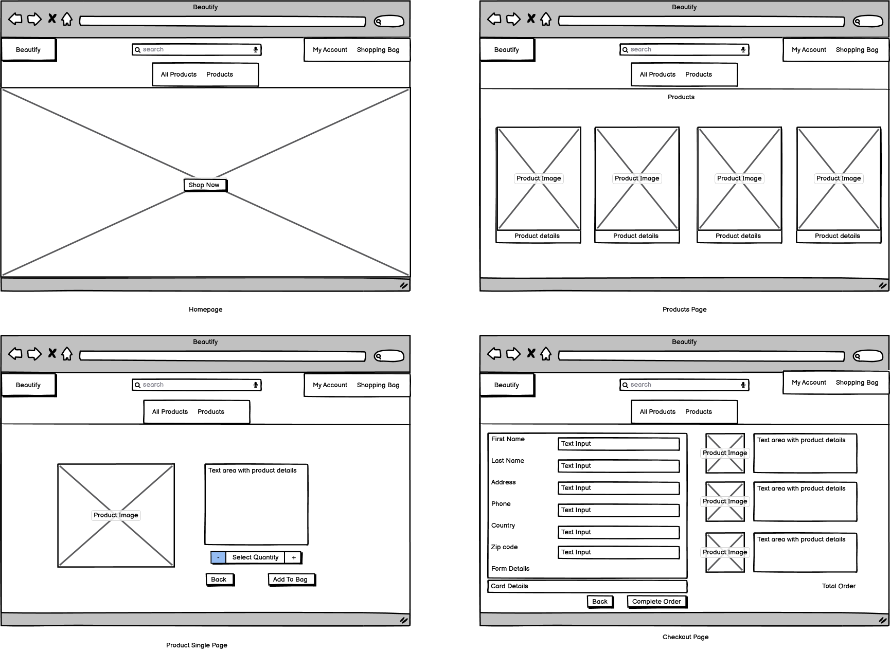
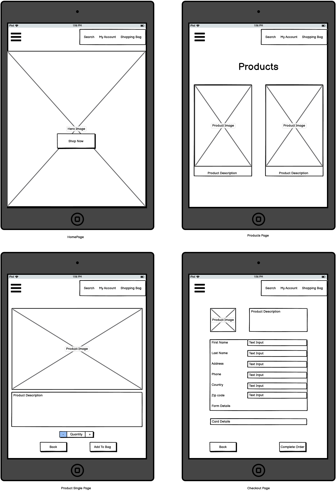
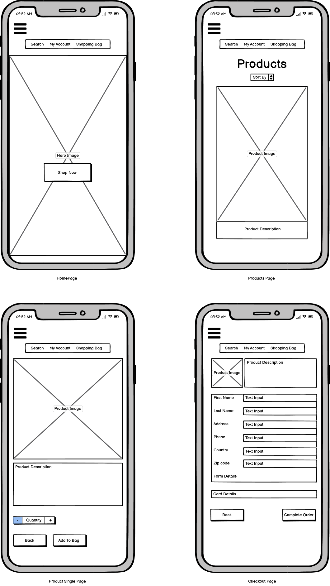

# Beautify

### Live Site = [Beautify](https://beautify-store.herokuapp.com/)

### Makeup Store 

#### Business Goals
  - To increase traffic to the site and in turn increase registration.
  - To provide simple easy sign up process to enable users to register.
  - To provide simple yet comprehensive information on products as well as allow purchasing.
  - To be visually striking enough to catch attention and provoke curiosity to explore the page.
  - To potentially encourage advertisers to place their ads on the page for brushes and other beauty items thus opening up more opportunities for more products, users, special offers and expansion of the site.
  - To build awareness of the brand.
  - Get users to purchase a makeup item.

#### Customer Goals
  - To find the best product for their needs.
  - To be able to find any information they may need.
  - To see benefits to signing up for such a site.
  - To be able to purchase products as an anonymous user or a registered user.

# UX

 #### Potential Customers

#### This website will provide value with
  - An easy and secure sign up process.
  - An easy and secure registration process.
  - An easy and secure payment process.
  - A simple format to navigate for older and younger users alike.
  - Accurate information.
  - A good UX so as to encourage visitors to register.

#### User Stories

 1. As a new user I want to know the sites purpose immediately.
 2. As a new user I want an intuitive search experience.
 3. As a new user I expect to be able to navigate the site easily to find a product.
 4. As a new user I expect to be able to sign up to services.
 5. As a potential customer I want an easy sign up process.
 6. As a potential customer I want easily explained details for the products.
 7. As a potential customer I want to have a good choice of filters for searching.
 8. As a returning user I want information and other useful content to entice me to return.
 9. As a returning user I want to be able to view my order history.
 10. As a returning user I want to be able to have access to follow the company on social media.
 11. As a user I expect to be able to login and out of my own profile.
 12. As a site admin I expect to be able to maintain the site.

# Design

## Colour Scheme

## Fonts

## Imagery

### Wireframes

#### **Desktop** 

#### **Tablet** 

#### **Mobile** 

#### **Database Design**

