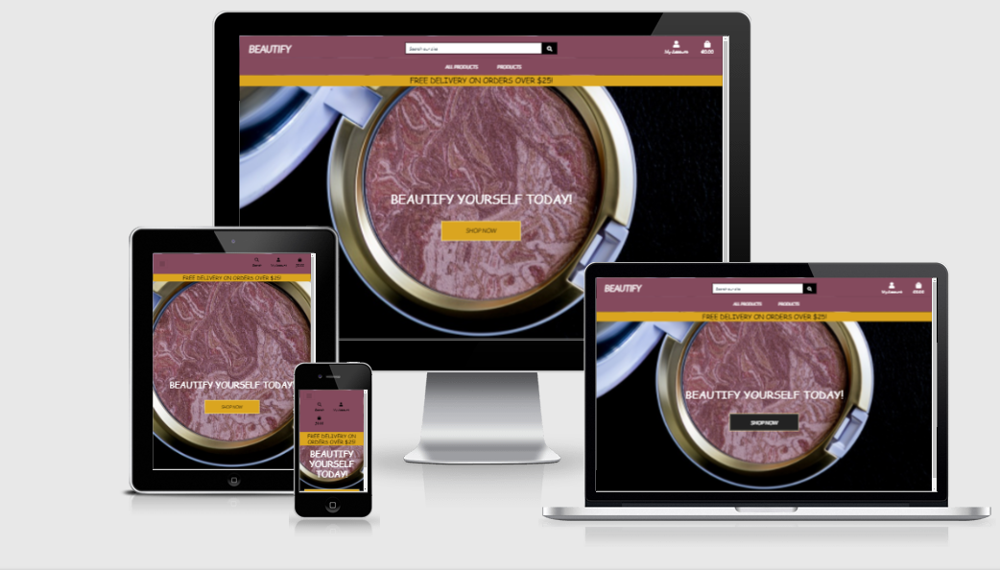

# Beautify

### Live Site = [Beautify](https://beautify-store.herokuapp.com/)

### Makeup Store 
A website designed to provide user's with a the ability to view and purchase make up products whther registered or not but for registered users provides an account that saves their information to make previous orders easy to view also.
It also feature **search** functionality and plenty of **filters** to allow the user to narrow down the type of products they wish to find. The site is laid out in a very simplistic way to allow maximum ease of use to users of all ages and abilities and on any platform. The site was deployed on Heroku and used AWS(Amazon web services) to host the static and site related media files. Django was used as the full stack framework to allow quick and eay construction of the site.

#### Business Goals
  - To increase traffic to the site and in turn increase registration.
  - To provide simple easy sign up process to enable users to register.
  - To provide simple yet comprehensive information on products as well as allow purchasing.
  - To be visually striking enough to catch attention and provoke curiosity to explore the page.
  - To potentially encourage advertisers to place their ads on the page for brushes and other beauty items thus opening up more opportunities for more products, users, special offers and expansion of the site.
  - To build awareness of the brand.
  - Get users to purchase a makeup item.

#### Customer Goals
  - To find the best product for their needs.
  - To be able to find any information they may need.
  - To see benefits to signing up for such a site.
  - To be able to purchase products as an anonymous user or a registered user.

# UX

#### Potential Customers

- This sites potential customers will be anyone in the make-up/beauty industry who wishes to purchase products. It is laid out to make it as simple as possible to purchase these products and should be easy to navigate for all assorments of users.

#### This website will provide value with
  - An easy and secure sign up process.
  - An easy and secure registration process.
  - An easy and secure payment process.
  - A simple format to navigate for older and younger users alike.
  - Accurate information.
  - A good UX so as to encourage visitors to register.

#### User Stories

 1. As a new user I want to know the sites purpose immediately.
 2. As a new user I want an intuitive search experience.
 3. As a new user I expect to be able to navigate the site easily to find a product.
 4. As a new user I expect to be able to sign up to services.
 5. As a potential customer I want an easy sign up process.
 6. As a potential customer I want easily explained details for the products.
 7. As a potential customer I want to have a good choice of filters for searching.
 8. As a returning user I want information and other useful content to entice me to return.
 9. As a returning user I want to be able to view my order history.
 10. As a user I expect to be able to login and out of my own profile.
 11. As a site admin I expect to be able to maintain the site.

# Design

## Colour Scheme
-  **Black** (#000000),
-  **White** (#ffffff),
-  **Dark Grey** (#555555),
-  **Dark Red** (#844a5d),
-  **Strong Orange** (#daa520),
-  **Pale Yellow** (#fffdd0),
-  **Pale Blue** (#e0e9f1),
-  **Light Blue** similar to **Pale Blue** (#a7c3d7),
-  **Light Grayish Blue** (#6c757d),
-  **Pale Grayish Blue** similar to **Light Grayish Blue** (#aab7c4),
-  **Bright Cyan** (#17a2b8),

## Fonts

The two main fonts on this page were 'Lato', with a default font of 'sans-serif'. These were used to keep the site easy to read and simple to navigate.

## Imagery

The images used for each product were taken for the API described and came with the other JSON data. I just called this API and used the image_link properly to display the relevent image whenever required. They are all make up related to keep with the theme of the site and I think overall even though they are not all consistent in size and content they executed their intended purpose and impact. The main hero image on the home page was taken from pixabay.com. I kept the images simple and to the point and did not want too many colliding feature related to them so as to allow for maximum impact between the products and the background and encourage the user to click them.

### Wireframes

#### **Desktop** 

#### **Tablet** 

#### **Mobile** 

#### **Database Design**

### Features 

## All Users
- Responsive on all devices.
- Register functionality, with email confirmation in place.
- Search functionality on products and filtering either by category, text input.
- Full integration with Stripe payments.
- Notification system using toasts.

### Registered Users
- User accounts with passwords properly hashed and cookies for logged in users.
- Users can view past orders on their account, along with storing their details for faster checking out.
- Log in, log out funstionality.

### Admin 
- Site admin has ability to search and change products from admin dashboard.

### Features Left to Implement
- **Terms and conditions** page to allow users to read through the legal documentation associated with the site.Too much time involved reviewing legal documentation to implement straight away.
- Option to change **languages** to some other than English.Too expensive to hire someone to check translations on current budget.
- Review section to allow users to leave reviews on products and rate them also, as the ratings are currently only accessible to the Admin.Not enought time to implement.
- Ability for superuser to edit and remove/add products without needing admin permissions. Time constraints did not allow for implementation.

# Technologies Used

- **[HTML5](https://en.wikipedia.org/wiki/HTML5)** - To write core content contained on site.
- **[CSS3](https://en.wikipedia.org/wiki/CSS)** - To style core content displayed on site.
- **[Python3](https://www.python.org/)** - To write core backend logic for the site.
- **[Django:](https://www.djangoproject.com/)** - Used as the main fullstack framework for the site.
- **[Amazon Web Services:](https://aws.amazon.com/)** - Used to host static and media files for the site.
- **[SQLite3](https://www.sqlite.org/releaselog/3_32_3.html)** - Used as the main database during development.
- **[PostgreSQL](https://www.postgresql.org/)** - Used as the main database for deployment of live site.
- **[Stripe](https://stripe.com/)** - Used as the payment processor for the site.
- **[Black](https://github.com/psf/black)** - Used to keep consistent file format throughout the python files.
- **[FontAwesome](https://fontawesome.com/)** - Used as a link and source for icons displayed on site.
- **[Git](https://git-scm.com/)** - Used as version control for the site.
- **[Gitpod](https://www.gitpod.io/)** - Used as the interactive development environment (IDE) for the project.
- **[GitHub](https://github.com/)** - Used to display and share all files related to the project.
- **[Balsamiq](https://balsamiq.com/wireframes/?gclid=CjwKCAiA8Jf-BRB-EiwAWDtEGkJ6iKra1Rpbr_P_NWTlH_xSyg5fnl9cG87m1uVtg1HJKb3bCsG0BhoC3yMQAvD_BwE)** - Used to create wireframes for the site.
- **[Placeholder](https://placeholder.com/)** - Used to add colors to Readme.
- **[Favicon.io](https://favicon.io/)** - Used to add Favicon to site.

# [Testing](TESTING.MD)

# Deployment 

- In order to deploy this project as I have the following is required [Python3](https://www.python.org/),  [Github account](https://github.com/),  [Heroku account](https://www.heroku.com/).

After you have succesfully signed up for these and installed the requirements proceed as below.

#### Step 1 Clone the project 

To make a local clone, follow these steps. 
1. Log in to GitHub and go to the repository to wish to clone. 
2. Click on the green button that reads **Code**.
3. Click on **“Open with GitHub Desktop”** and follow the prompts.

#### Step 2 Use the local copy
To run the project locally. Install:
* Git
* Django

1. Install all the requirements: Go to the workspace of your local copy.
2. Create a `.env` file containing the following credentials:

Env Vars | Value
----------- | -------------
AWS_ACCESS_KEY_ID | `<AWS_ACCESS_KEY_ID>`
AWS_SECRET_ACCESS_KEY | `<AWS_SECRET_ACCESS_KEY>`
DATABASE_URL | `<DATABASE_URL>`
EMAIL_HOST_USER | `<EMAIL_HOST_USER>`
EMAIL_HOST_PASS | `<EMAIL_HOST_PASS>`
SECRET_KEY | `<SECRET_KEY>`
STRIPE_PUBLIC_KEY | `<STRIPE_PUBLIC_KEY>`
STRIPE_SECRET_KEY | `<STRIPE_SECRET_KEY>`
STRIPE_WH_SECRET | `<STRIPE_WH_SECRET>`
USE_AWS | `<TRUE>` 

3. In the terminal type: **pip3 install -r requirements.txt** and hit enter, this will create
a file which python will need to run correctly as it contains a list of required dependancies.

You can run the app by running: `python manage.py runserver` which will run the project on the 8000 server port.

#### Step 3 Deploying to Heroku 

1. Install **gunicorn** package to run the application on Heroku.
    - `sudo pip3 install gunicorn`
2. Install **pycopg2** to connect to PostgreSQL
    - `sudo pip3 install psycopg2`
3. Create a **requirements.txt** file
    - `sudo pip3 freeze --local > requirements.txt`
4. Create a new Heroku application
    - Sign up to a new account unless you already have one.
    - Create a new application by clicking on `new` then `create new app`.
    - Set the name of your application and select your region to the closest that applies for me it was **Europe** and click on `create app` to finalize the creation of your app. 
5. Install PostgreSQL add-on
    - `heroku addons:create heroku-postgresql:hobby-dev`
6. Create a **Procfile** in the root directory
    - content: `web: gunicorn spacex.wsgi:application`
7. Set the following config variables as environment variables:

Config Vars | Value
----------- | -------------
AWS_ACCESS_KEY_ID | `<AWS_ACCESS_KEY_ID>`
AWS_SECRET_ACCESS_KEY | `<AWS_SECRET_ACCESS_KEY>`
DATABASE_URL | `<DATABASE_URL>`
EMAIL_HOST_USER | `<EMAIL_HOST_USER>`
EMAIL_HOST_PASS | `<EMAIL_HOST_PASS>`
SECRET_KEY | `<SECRET_KEY>`
STRIPE_PUBLIC_KEY | `<STRIPE_PUBLIC_KEY>`
STRIPE_SECRET_KEY | `<STRIPE_SECRET_KEY>`
STRIPE_WH_SECRET | `<STRIPE_WH_SECRET>`
USE_AWS | `<TRUE>`

8. Add and then commit the requirements.txt and Procfile to repository. 
9. Go back to the deploy tab in Heroku and navigate to **Automatic deployment**.
10. Click on **Enable Automatic Deployment** by using **Manual deployment**.
11. Finally Click on **Deploy Branch**.

To View the live app you can click on **Open app** in the right corner of your Heroku account. The app will open and deployment is successful.

# Credits 

 ## Code

  - The base of this project was styled off of Code Institutes "Boutique Ado" project and this was used both to aid in the correct styling of features like cards, and to help in implementing some of the python logic on the website. I added my own data and manipulated the logic to fit my requirements when needed.

 - My mentor **Marantha Ilesanmi** for his help with implementation of my project and for solid advice concerning issues faced in development.

 - All other code was written by the creator of the site - **Paul King**.

 ## Content 

 - The makeup data in the JSON files contained in the fixture was taken from **[Makeup-API](https://makeup-api.herokuapp.com/)** and this data was then edited as I needed to fit my purposes.

 ## Text

 - The makeup information and text in the JSON files contained in the fixture was taken from **[Makeup-API](https://makeup-api.herokuapp.com/)** and this data was then edited as I needed to fit my purposes.

 ## Media 

 - The hero image on the homepage was taken from **[Pixabay](https://pixabay.com/)**.

 - The makeup pictures in the JSON files contained in the fixture was taken from **[Makeup-API](https://makeup-api.herokuapp.com/)** and this data was then edited as I needed to fit my purposes.

 ## Acknowledgements 

 - My mentor **Marantha Ilesanmi** for his help, advice and patience.
 - Code Institute and their mentors and tutors.